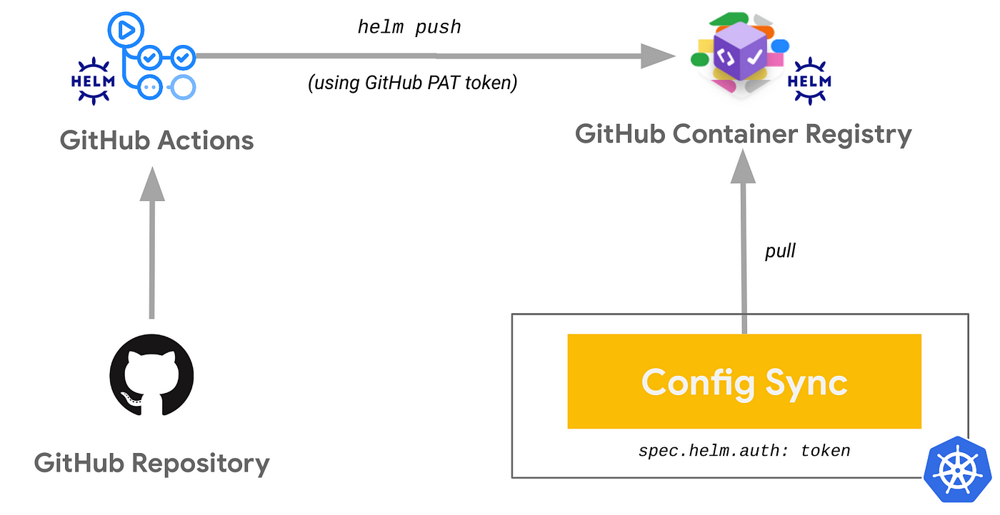

# GitHub Actions

## CI/CD with GitHub Actions & Kubernetes



## 준비 작업 (Nayoung Park)

### 🔐 1단계: Personal Access Token(PAT) 발급하기

1. GitHub에 로그인한 후, 우측 상단의 프로필 사진을 클릭하고 **Settings**를 선택합니다.
2. 좌측 사이드바에서 **Developer settings**를 클릭합니다.
3. **Personal access tokens** > **Tokens (classic)**를 선택합니다.
4. **Generate new token** > **Generate new token (classic)**를 클릭합니다.
5. 토큰의 이름을 입력하고, 필요한 권한을 선택합니다:
    - `write:packages`
    - `read:packages`
    - `delete:packages` (선택 사항)
    - `repo` (프라이빗 저장소의 경우 필요)
6. 토큰의 만료 기간을 설정합니다.
7. **Generate token**을 클릭하여 토큰을 생성합니다.
8. 생성된 토큰을 복사하여 안전한 곳에 저장합니다.

⚠️ 생성된 토큰은 한 번만 표시되므로 반드시 복사하여 보관하세요.

### 🛡️ 2단계: GitHub 리포지토리에 토큰 등록하기

1. 해당 리포지토리의 페이지로 이동하여 **Settings**를 클릭합니다.
2. 좌측 사이드바에서 **Secrets and variables** > **Actions**를 선택합니다.
3. **New repository secret** 버튼을 클릭합니다.
4. 다음 정보를 입력합니다:
    - **Name**: `GHCR_PAT`
    - **Secret**: 앞서 생성한 Personal Access Token
5. **Add secret**를 클릭하여 저장합니다.
    - [docs.salad.com](https://docs.salad.com/products/sce/container-groups/registries/github-ghcr?utm_source=chatgpt.com)
    - [GitHub Docs](https://docs.github.com/en/authentication/keeping-your-account-and-data-secure/managing-your-personal-access-tokens?utm_source=chatgpt.com)

## GitHub Actions 파이프라인 구성 (Nayoung Park)

```vim
[GitHub Push]
   ↓
[GitHub Actions (CI)]
   → 빌드
   → 테스트
   → docker build/push
   ↓
[쿠버네티스]
   → 이미지 변경 감지
   → rollout
   → scale, monitor, recover
```

### Sequence diagram

```mermaid
sequenceDiagram
    participant Dev as 개발자
    participant GH as GitHub Actions
    participant GHCR as GHCR Registry
    participant Server as 배포 서버 (Webhook 리스너)

    Dev->>GH: push to main
    GH->>GH: build & test
    GH->>GHCR: docker push
    GH->>Server: POST /hook/deploy
    Server->>GHCR: docker pull image
    Server->>Server: docker-compose up -d
```

## 실행

[.github/workflows/ci.yml](../.github/workflows/ci.yml) 파일을 참고해 주세요.

### Git push

```yaml
on:
  push:
    branches: [ main ]
  pull_request:
    branches: [ main ]
```

`main` 브랜치에 push 또는 pull request가 발생하면 GitHub Actions가 실행됩니다.

### Build & Test, Docker Build & Push

```yaml
jobs:
  build:
    ....
  docker-build:
    ....
```

- `build`는 Python 환경에서 코드 자체가 잘 돌아가는지 확인
- `docker-build`는 컨테이너로 배포할 준비가 되었는지 확인

[ci.yml](../.github/workflows/ci.yml) 파일에서 [DockerFile](../Dockerfile)를 가지고 build를 한 다음에 GHCR(GitHub Container Registry)에 push를 합니다.

### 작업진행 상황 확인 및 배포 (/wo K8S)

1. Github repository에서 Actions 탭을 클릭합니다.
2. 작업 진행 상황을 확인할 수 있습니다.
3. 작업이 성공적으로 완료가 되면 Docker Image가 GHCR에 업로드 됩니다.
4. 배포할 서버에서 Docker Image를 가져오고 실행합니다.
    - `docker pull ghcr.io/mago-op/mago-op-whisper:latest`
5. `docker-compose.yml` 파일이 있으면 실행합니다.
    - `docker-compose up -d`
